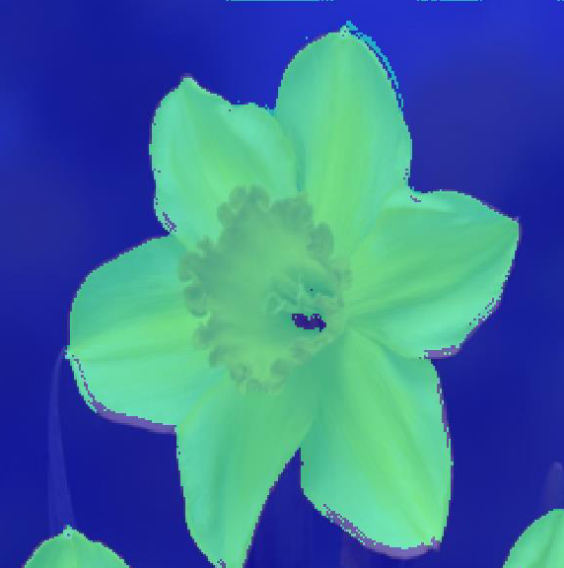

# Flower Segmentation using U-Net and Custom CNN

This project is part of the **COMP3007 Computer Vision Coursework** and presents a methodology for segmenting flowers from images. The project involves two convolutional neural networks (CNNs): one based on the existing U-Net architecture, and the other a simplified custom CNN model. The U-Net model was chosen for its advanced feature reuse capabilities, and the custom model was developed to reduce training time while attempting to maintain high accuracy.

## Table of Contents
- [Project Overview](#project-overview)
- [Data Preparation](#data-preparation)
- [Model Architectures](#model-architectures)
- [Training and Evaluation](#training-and-evaluation)
- [Results](#results)
- [Requirements](#requirements)
- [Usage](#usage)
- [References](#references)

## Project Overview

The objective of this project was to compare the performance of a U-Net model with a custom-designed CNN for flower segmentation. Both models were trained and tested on a dataset containing annotated flower images. The U-Net model performed well, but with higher training times, while the custom model, although faster, showed some limitations in its segmentation accuracy.

## Data Preparation

The dataset consists of flower images and their corresponding pixel-level annotations. The images are stored in `data_for_moodle/images_256`, and the annotations are in `data_for_moodle/labels_256`. Only annotated images are used for training and testing, where the classes of interest are:
- `flower`: represented by pixel value 1
- `background`: represented by pixel value 3

Data is split into 80% for training and 20% for testing, and the split is reproducible using a fixed random seed.

## Model Architectures

### 1. **U-Net Architecture**:
The U-Net model was chosen for its ability to handle complex segmentation tasks. It uses skip connections to retain localized feature information during upsampling, leading to more precise segmentations.

### 2. **Custom CNN Architecture**:
The custom model was designed to be computationally lighter and faster to train. It consists of three encoder blocks and two decoder blocks, each using convolutional layers with batch normalization and ReLU activation. The architecture sacrifices complexity for speed by reducing the number of layers and filters.

## Training and Evaluation

### Training:
- **Optimizer**: Adam
- **Learning Rate**: 0.001
- **Epochs**: 1 (for demonstration purposes)
- **Batch Size**: 16
- **Shuffle**: Data is shuffled every epoch to ensure robustness during training.

Both models were trained using the same dataset and evaluated using Intersection over Union (IoU) and Pixel Accuracy metrics.

### Testing:
After training, the models were tested on the held-out 20% of the data. The segmentation results were compared with the ground truth annotations, and evaluation metrics were computed using MATLAB’s `evaluateSemanticSegmentation` function.

## Results

- **U-Net**: Produced more accurate segmentation results but took significantly longer to train.
- **Custom Model**: Faster to train but suffered from some misclassifications, particularly on image edges.

### Example Metrics:
- **U-Net IoU**: Higher due to better edge preservation.
- **Custom Model IoU**: Lower due to inaccuracies, especially at image borders.


  ### Example Overlays:
- **U-Net Overlay**:
  
  
- **Custom Model Overlay**:
  

## Requirements

- MATLAB R2023a or later
- Image Processing Toolbox
- Deep Learning Toolbox

## Usage

1. Clone the repository:
   ```bash
   git clone https://github.com/yourusername/flower-segmentation.git
   cd flower-segmentation
   ```

2. Run the segmentation script in MATLAB:
   ```matlab
   run('segment_flowers.m')
   ```

3. To train the models, modify `trainNetwork` parameters in the provided script:
   ```matlab
   net = trainNetwork(trainingData, layers, options);
   ```

4. To evaluate the model:
   ```matlab
   metrics = evaluateSemanticSegmentation(pxdsResults, pxdsTest, 'Verbose', true);
   ```

## References

1. Taparia, A. (2023). *U-Net Architecture Explained*, GeeksforGeeks. [Link](https://www.geeksforgeeks.org/u-net-architecture-explained/)
